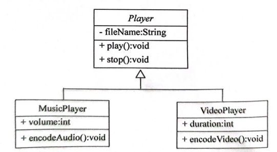

# java学习代码&&作业代码

---
## 1. homework1 (变量和命名)
- FabrenheitChangeCelsius   
华氏温度转化为摄氏度，公式为：c = 5 / 9 *（f - 32)
- TwoNumberChangeOrder   
将两位数的中个各位和十位进行调换的到一个新的值。  
- OutputEverybodySum   
计算输入的三位数的个位、十位、百位之和

- CylinderVolume  
计算圆柱的体积，公式为:v = PI * h * (r ** 2)
    - PI:Π
    - h:圆柱的高
    - r:圆柱的半径
    - r ** 2: 圆柱的平方
- CalcuateExpression  计算一元二次方程的根
计算表达式，求函数的根的表达式。

## 2. homework2 (判断)

- CalcuateMonth 使用switch结构计算每个月的天数。
  - 闰年计算公式:
      1. 能被4整除，不能被100整除
      2. 能被400整除
      两个条件满足任意一个就都是闰年。
- GetScoreGrade  根据成绩判断属于那个等级
  > 使用``if...else if...else...``嵌套语句进行判断，先判断是否超过取值范围。
  - 90-100分为Ａ级；
  - 80-89分为B级；
  - 70-79分为Ｃ级；
  - 60-69分为D级；
  - 0-59分为E级

## 3. homework3 (循环)

- MultiplicationTable 打印九九乘法表
- GuessNum  猜随机数  
随机产生一个[10,50]的数，然后和用户输入的数进行比较,
猜对为止。
- PromeNums 打印前50个素数  
使用两层for循环
- DecimallismChangeBinary  十进制转化为二进制

- CalcuateValue  用户输入5个数存放到数组中,然后计算出
数组中打最大值、最小值、和、平均值。

## 4. homework4 (数组)

- ArrayMin  求数组中最小值  
- CopyArray  复制数组  
- SumArrary  数组求和  
- StudentScore 计算学生的最高成绩以及没科最高的学生成绩信息
- PascalsTriangle 打印杨辉三角

## 5. homework5 (面向对象之对象)
- AcountTest 模拟存款系统
- CircleTest 使用面向对象实现，圆的面积、体积的计算
- PersonTest 使用面向对象实现，get、set方法的使用
- QuadraticEquationTest 使用面向对象实现，求一元二次方程的根
- RectangleTest 使用面向对象实现，矩形的面积和周长

## 6.homework6(面向对象的特征)
- topic1   
创建一个Cylinder类表示圆柱，继承Circle类，覆盖getArea()方法求圆柱的表面积，定义getVolume()方法求圆柱的体积。
- topic2   
定义一个名为Square类表示正方形，继承Shape抽象类。覆盖Shape类中的抽象方法getPerimeter()和GetArea()。
- topic3  
设计一个汽车Auto类，包含一个表示速度的double型的成员变量speed、表示启动的start( )方法、表示加速的speedUp( )方法以及表示停止的stop( )方法。在设计一个Bus类
表示公共汽车，在Bus类中定义一个int型的表示乘客数的成员变量passenger，另外定义两个方法gotOn( )和gotOff( )表示乘客上车和下车。
- topic4    
定义一个名为Cuboid的长方体类,使其继承Rectangle类,包含一个表示高的double型成员变量height; 定义一个构造方法Cuboid(double length,double width,double height); 
再定义一个求长方体体积的volume( )方法.
- topic5  
  定义抽象类Player类及其子类MusicPlayer类和VideoPlayer类。其中，抽象类Player表示播放器，fileName是播放的文件，play()和stop()表示播放和停止方法；MusicPlayer类表示音频播放器，volume表示音量，encodeAudio()表示音频解码；VideoPlayer表示视频播放器，duration表示视频持续时间，encodeVideo()表示视频解码。

  1. 编写程序实现这些类，为这些类定义无参构造方法，并在构造方法中输出一句话，实现每个类中定义的方法。  
  2. 在main()方法中创建一个MusicPlayer对象，访问该对象的volume成员、play()与stop()、encodeAudio()方法、toString()方法。  
  3. 在main()方法中创建一个VideoPlayer对象，访问该对象的duration成员、play()与stop()、encodeVideo()方法、toString()方法。  